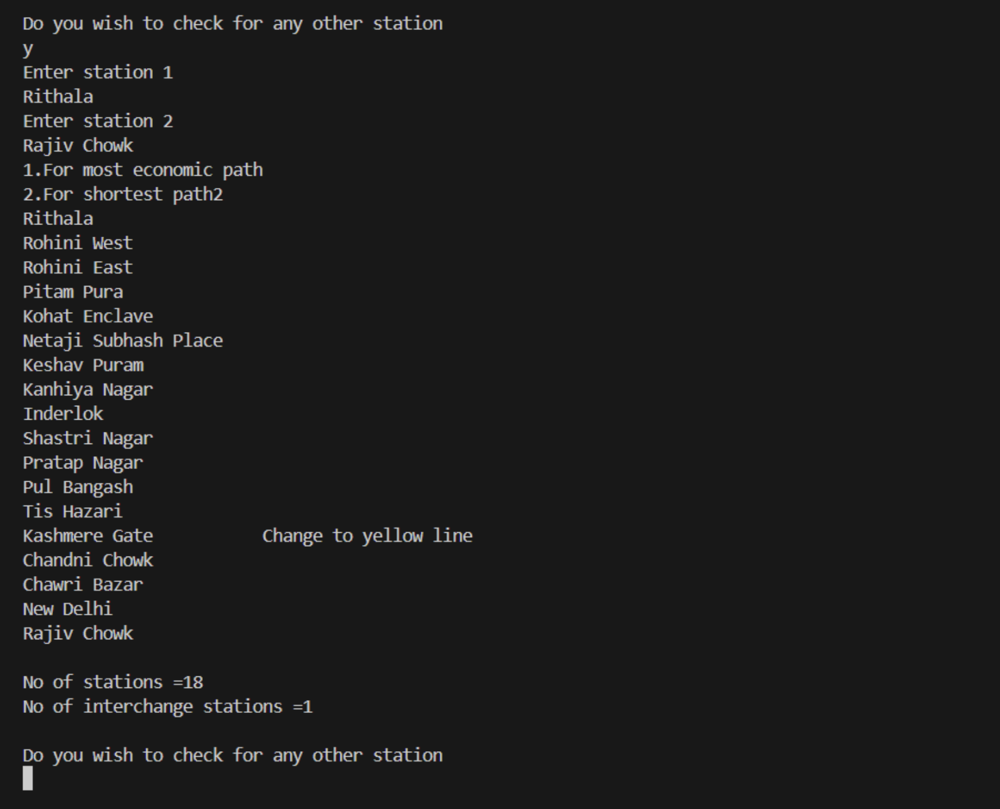

# Metro-Guide

**Metro-Guide** is a C++ application designed to help users navigate the Delhi Metro system efficiently. The application provides optimal paths between stations using algorithms such as Dijkstra's and weighted graph traversal. It also allows users to explore the nearest metro stations to various tourist places.


## 🚀 Features

* **Shortest Path Calculation:** Uses Dijkstra's algorithm to determine the quickest route between two stations.
* **Economical Path Calculation:** Finds the most cost-effective route by considering the fare as the edge weight in the graph.
* **Tourist Spot Navigation:** Identifies the nearest metro stations to popular tourist attractions.
* **Metro Network Representation:** Models the Delhi Metro system with all lines and stations using an adjacency list or matrix.


## 🛠️ Technologies Used

* **Programming Language:** C++ (C++17 or higher recommended)
* **Algorithms Implemented:**

  * Dijkstra’s algorithm for shortest path calculation.
  * Weighted graph traversal for economical path finding.


## 📂 Project Structure

```
├── .gitignore           # Git ignore file for unnecessary files
├── README.md            # Project documentation
├── Screenshot.png       # Working demonstration
├── a.out                # Executable file for Linux (compiled)
├── blueline.txt         # Contains data for the Blue Line stations
├── bluetxt.txt          # Additional blue line station info
├── greenline.txt        # Data for Green Line stations
├── list.txt             # Metro lines list
├── metro.cpp            # Main source code (C++ file)
├── metro.exe            # Executable file for Windows (compiled)
├── orangeline.txt       # Data for Orange Line stations
├── paisa.txt            # Data related to fare (paisa)
├── redline.txt          # Data for Red Line stations
├── tourplace.txt        # Tourist place data for nearest metro stations
├── violetline.txt       # Data for Violet Line stations
└── yellowline.txt       # Data for Yellow Line stations
```


## ⚙️ How to Run

### Prerequisites

1. A C++17 compatible compiler (e.g., g++, clang++).
2. CMake (optional, for building).

### Steps to Run

1. Clone the repository:

   ```bash
   git clone https://github.com/Aman-993/Metro-Guide.git
   cd Metro-Guide
   ```

2. Compile the code:

   ```bash
   g++ metro.cpp -o metro
   ```

3. Run the application:

   ```bash
   ./metro
   ```


## 📸 Screenshots




